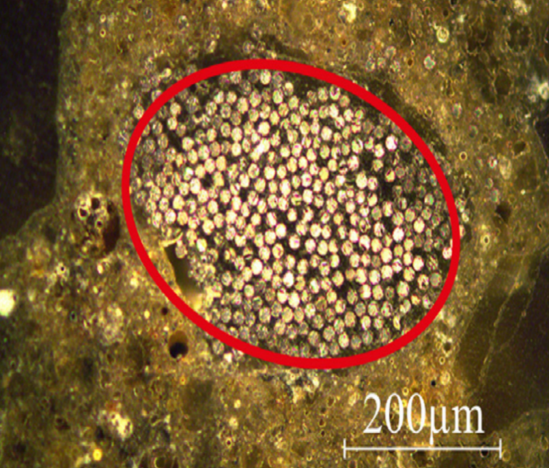
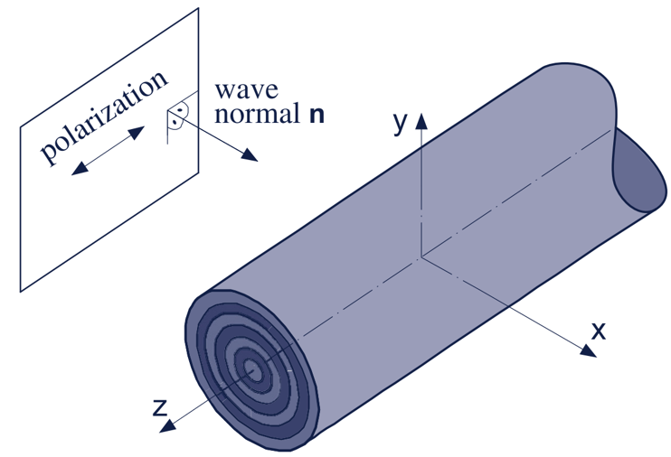
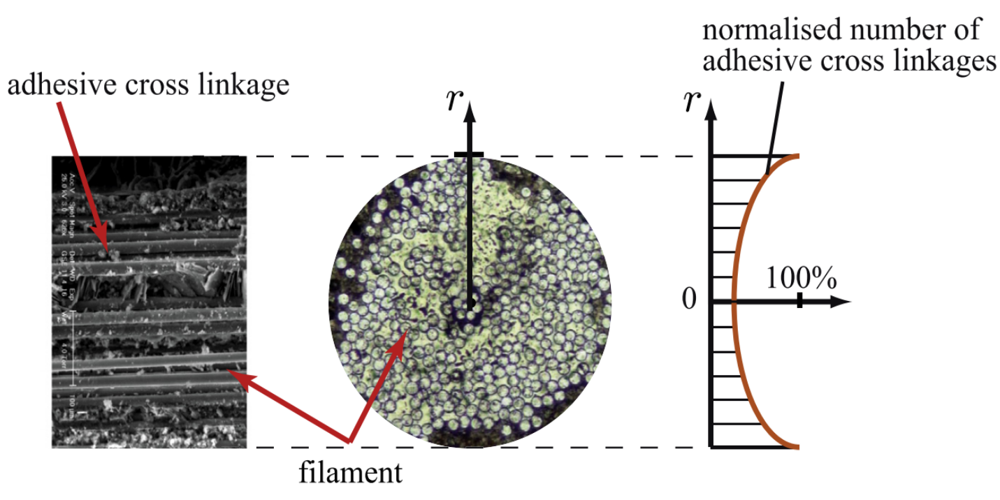
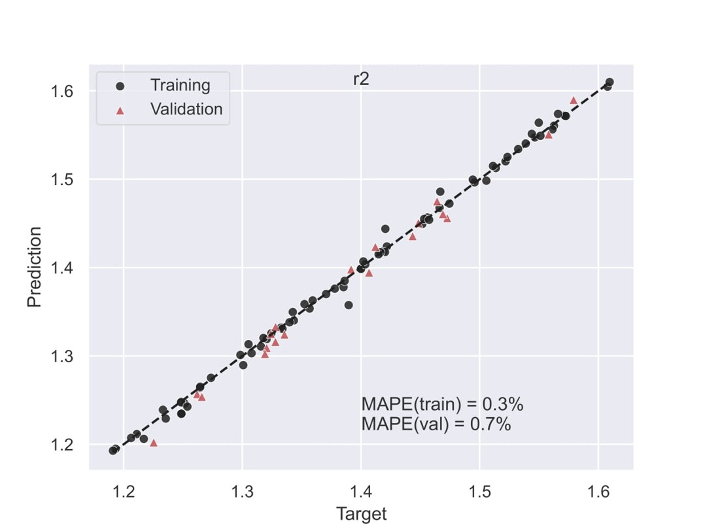
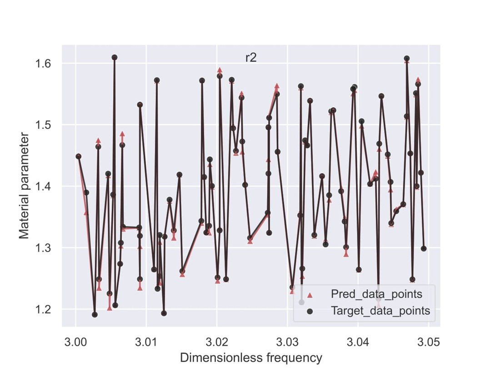

# Analysis of an autoencoder-based approach for determining the configuration of embedded obstacles

This repository contains the code, methods, and documentation for my Project Work during my Master’s in *Advanced Computational and Civil Engineering Structural Studies* at **TU Dresden**. The focus of the project is on developing a machine learning-based inverse modeling framework that can infer the internal microstructure of composite materials using ultrasonic amplitude response data.

---

## 📌 Overview

This project tackles the challenging **inverse problem** of estimating internal configuration parameters (geometry + material properties) of **fiber-reinforced cementitious composites** from the **amplitude spectra** of **ultrasonic wave scattering**. The solution involves combining a **2D analytical wave propagation model** with a **convolutional autoencoder-based neural network**.

---

## 🧪 Problem Background

Fiber-reinforced composites exhibit complex internal structures composed of:

- A **core fiber**
- One or more **interphase layers**
- A surrounding **matrix**

When subjected to ultrasonic waves, these internal heterogeneities scatter waves in distinctive ways. The way these waves scatter carries valuable information about the **geometry** and **material properties** of internal inclusions (e.g., fiber radii, stiffness, density).

However, traditional **analytical models** break down when complexity increases (e.g., multilayered or non-homogeneous structures). Hence, a **numerical metamodel** using deep learning was proposed to decode wave data back into internal structure.

---

## 🎯 Objective

To develop a deep learning framework (based on convolutional autoencoders) that can:

- Analyze **ultrasonic amplitude response fields**
- **Infer unknown internal configurations** (e.g., layer radii, elastic moduli, and densities)
- Act as a **numerical metamodel** to supplement or replace traditional analytical models

---

## 🧰 Methodology

### 1. Data Generation – Analytical Model

- A **2D mechanical wave scattering model** was used to simulate a cross-section of a fiber-reinforced composite.
- The composite includes:
  - A **core fiber**
  - One or more **interphase layers**
  - An outer **matrix**
- The model computes how ultrasonic waves scatter as they encounter these inclusions.
- A **large spatial grid** was defined in the simulation domain.
- **The refracted amplitude fields were normalized** before being used for model training.
  
  > 🔎 *This normalization ensures that variations due to absolute signal intensity (e.g., sensor sensitivity, source energy) don't bias the learning process.*

> 🧾 **Each simulation corresponds to one unique configuration of material and geometric properties.**

---

## 🗃️ Dataset Structure

### 🔷 Input Columns (Obstacle Configuration)

These are the geometric and material properties for each simulation:

- `r_fiber`: Radius of the fiber  
- `t_interphase`: Thickness of the interphase layer  
- `E_matrix`, `rho_matrix`: Young’s modulus and density of the matrix  
- `E_interphase`, `rho_interphase`: Modulus and density of the interphase  
- `E_fiber`, `rho_fiber`: Modulus and density of the fiber  

### 🔶 Output Columns (Amplitude Response Field)

- Each simulation outputs **100,000 amplitude values**, one for each **physical point** in the spatial domain (i.e., a 2D grid over the composite cross-section).
- These values form a **high-dimensional response field**—showing how waves scatter across space.

> ✅ **Each datapoint in the output vector represents the amplitude at one physical location in the model.**

---

## 🧠 Inverse Model

The inverse problem is to **predict input configuration parameters from the amplitude response field**.

### 🔄 Mapping

```text
Amplitude Response Field (100,000-dimensional vector) → [r_fiber, t_interphase, E_matrix, ..., rho_fiber]
```

This was solved using a **deep convolutional autoencoder** with a small dataset and several learning enhancements.

---

## 🏗️ Machine Learning Pipeline

### ✔️ Architecture

- Autoencoder structure with:
  - **Convolutional encoders** to compress the 100k-point wave field into latent features
  - **Fully connected decoder** to predict obstacle parameters from these features

### ✔️ Dataset Size

- **Total samples**: 94  
- Each sample has:
  - One set of 8 input parameters
  - One set of 100,000 amplitude values (output)

> ℹ️ The relatively small number of samples was balanced by high-resolution wave data and smart training strategies.

---

## 🧪 Advanced Training Strategies

### ✅ Patchwise Training

- Rather than using the entire amplitude field, training was done over **narrow "patches"**—small spatial regions within the 2D domain.
- This improved:
  - Local learning
  - Model generalization
  - Outlier robustness

### ✅ Similarity Filtering

- Inverse problems can be **ill-posed** if multiple configurations yield nearly identical wave responses.
- So, a **similarity analysis** was conducted:
  - Compared output vectors
  - Removed near-duplicates
- This ensured a **bijective mapping** between inputs and outputs.

### ✅ Normalization

- Inputs (e.g., radii in mm, densities in kg/m³) were normalized to prevent scale mismatch during training.
- This helped:
  - Gradient flow
  - Faster convergence
  - Better generalization

---

## 📈 Model Performance

### 🔹 Training vs. Validation Loss

- Training loss decreases smoothly  
- Validation loss plateaus → indicates some overfitting but still strong learning

### 🔹 Prediction Accuracy

r1: Radius of the fiber core (innermost circle)

r2: Radius of the interphase layer boundary, i.e., the outer boundary of the interphase

| Parameter | Training MAPE | Validation MAPE |
|-----------|----------------|------------------|
| r1        | ~0.3%          | ~0.7%            |
| r2        | ~0.5%          | ~2.3%            |

---

## 🖼️ Visual Explanation

Below are figures included in this repository to help visualize the model and results:

### 📌 3D & 2D View of Fiber Structure
- 3D rendering of cylindrical fiber within a matrix

- 2D cross-section shows concentric layers (core, interphase, matrix)


### 📌 Microstructure & Adhesive Profile
- SEM and micrograph images show real-world fiber cross-sections
- Plot shows radial adhesive cross-link density (supports modeling assumptions)


### 📌 Predicted vs Actual r2
- Scatter plot comparing predicted and actual values
- High overlap = strong predictive power


### 📌 Material Parameter vs Frequency Patch
- Stability of predictions across small frequency window (patch from 3.00 to 3.05)



---

## 📂 Reference Code

Here's a snippet of the core SQL code used in this project (e.g., signal processing, z-score outlier removal, min-max normalization):

– This section handles data cleaning and preprocessing directly within MySQL before feeding into the model.

#### Reference Code 1: 
```sql
-- Step 1: Create normalized table
CREATE TABLE IF NOT EXISTS amplitude_response_normalized (
    id INT AUTO_INCREMENT PRIMARY KEY,
    simulation_id INT,
    point_index INT,
    amplitude FLOAT,
    amplitude_norm FLOAT,
    FOREIGN KEY (simulation_id) REFERENCES simulations(id)
);

-- Step 2: Clean + Normalize amplitudes (Z-score filtering + Min-Max normalization)
INSERT INTO amplitude_response_normalized (simulation_id, point_index, amplitude, amplitude_norm)
SELECT
    ar.simulation_id,
    ar.point_index,
    ar.amplitude,
    (ar.amplitude - mm.min_amp) / NULLIF((mm.max_amp - mm.min_amp), 0) AS amplitude_norm
FROM amplitude_response ar

-- Join for mean and stddev per simulation (for Z-score)
JOIN (
    SELECT
        simulation_id,
        AVG(amplitude) AS mean_amp,
        STDDEV_POP(amplitude) AS std_amp
    FROM amplitude_response
    WHERE amplitude IS NOT NULL
    GROUP BY simulation_id
) stats ON ar.simulation_id = stats.simulation_id

-- Join for Min-Max normalization per simulation
JOIN (
    SELECT
        simulation_id,
        MIN(amplitude) AS min_amp,
        MAX(amplitude) AS max_amp
    FROM amplitude_response
    WHERE amplitude IS NOT NULL
    GROUP BY simulation_id
) mm ON ar.simulation_id = mm.simulation_id

-- Apply Z-score based outlier filter
WHERE ar.amplitude IS NOT NULL
  AND ABS((ar.amplitude - stats.mean_amp) / NULLIF(stats.std_amp, 0)) <= 3;
```

Here's a snippet of the core Python code used in this project (e.g., model architecture, training loop, evaluation):

– This section defines and trains the machine learning model using the preprocessed data.

#### Reference Code 2: 
```python
"""Convolution 1D and autoencoder"""
# Note: Spaghetti code needs to be fixed!
import time
import random
import pickle
import tensorflow as tf
import numpy as np
from datetime import timedelta
from keras.models import Sequential, Model
from keras.layers import Input, Dense, Conv1D, MaxPool1D, Flatten
from matplotlib import pyplot as plt
from sklearn.preprocessing import MinMaxScaler
from sklearn.model_selection import train_test_split
from pandas import read_csv, DataFrame, concat
import seaborn as sns
from sklearn.metrics import r2_score, mean_absolute_error, mean_squared_error, mean_absolute_percentage_error


# Accuracy metrics
def calculate_metrics(y_true, y_pred):
    metrics = {'MSE': mean_squared_error(y_true, y_pred, multioutput='raw_values'),
               'MAE': mean_absolute_error(y_true, y_pred, multioutput='raw_values'),
               'MAPE': mean_absolute_percentage_error(y_true, y_pred, multioutput='raw_values'),
               'R2': r2_score(y_true, y_pred, multioutput='raw_values')}
    return metrics


sns.set_theme()
np.random.seed(42)
random.seed(42)
tf.random.set_seed(42)


# Load Data
# Setting a range on one of the input feature
start_time = time.monotonic()
max_range = 3.05
min_range = 3
df = DataFrame(read_csv("dfs/df1.txt", delim_whitespace=True)).iloc[:, :]
print(df.iloc[0:20, :].to_string())
index, = np.where((df.iloc[:, 0] < min_range) | (df.iloc[:, 0] > max_range))
Indices = np.array(index)
print(DataFrame(Indices))
# df = df.drop(([index for index in Indices]))                                # To preserve the indices of the DataFrame
df = DataFrame(np.delete(np.array(df), ([index for index in Indices]), axis=0))
print(df)


# Removing similar output samples
Sim = df.iloc[:, 9:19]
# Sim = df1.iloc[:, 1:9]
indices_list = []
for i in range(len(Sim)):
    x = np.array(Sim.iloc[i, :])
    for j in range(len(Sim)-1):
        y = np.array(Sim.iloc[j+1, :])
        if i == j+1:
            break
        p = abs(np.array([x1 for x1 in x])-np.array([y1 for y1 in y]))/np.array([x1 for x1 in x])*100
        # print("Index " + str(j+1) + " and " + "Index " + str(i), p)
        sample_list = []
        for pp in p:
            if pp < 0.05:
            # if pp < 0.005:
                sample_list.append(1)
            else:
                sample_list.append(0)
        total = 0
        for ii in sample_list:
            total = total + ii
        # print("Number of elements with error < 2%: ", sum, " elements")
        if total > 3:
            # print("Similar Index:", j+1)
            indices_list.append(j+1)
common_indices_list = np.array(np.unique(indices_list))
print(common_indices_list)
df = DataFrame(np.delete(np.array(df), ([index for index in common_indices_list]), axis=0))
print(df)


end_time = time.monotonic()
print("\n\n\n\nTIME: ", timedelta(seconds=end_time - start_time))


# Splitting the data into training and validation
# # df = df.sample(frac=1)
X_DF = df.iloc[:, 0:9]                                                      # Forward
Y_DF = df.iloc[:, 9:19]                                                     # Forward
X = X_DF.iloc[:, [0, 1, 2, 3, 4, 5, 6, 7]]                                         # Forward
Y = Y_DF.iloc[:, [0, 1, 2, 3, 4, 5, 6, 7, 8, 9]]                                     # Forward
# X_DF = df.iloc[:, [0, 9, 10, 11, 12, 13, 14, 15, 16, 17, 18]]               # Inverse
# Y_DF = df.iloc[:, 1:9]                                                      # Inverse
# X = X_DF.iloc[:, [0,1,2,3,4,5,6,7,8,9,10]]                                  # Inverse
# Y = Y_DF.iloc[:, [0,1,2,3,4,5,6,7]]                                         # Inverse
X_train, X_test, Y_train, Y_test = train_test_split(X, Y, test_size=0.20, random_state=13)


# Scale data
org_X_train = np.array(X_train.copy())
org_X_test = np.array(X_test.copy())
org_Y_train = np.array(Y_train.copy())
org_Y_test = np.array(Y_test.copy())
scalerx = MinMaxScaler(feature_range=(-0.5, 0.5))
scalerx.fit(X_train)
X_train = scalerx.transform(X_train)
X_test = scalerx.transform(X_test)
Y_train = np.log10(Y_train)
Y_test = np.log10(Y_test)
scalery = MinMaxScaler(feature_range=(-0.5, 0.5))
scalery.fit(Y_train)
Y_train = scalery.transform(Y_train)
Y_test = scalery.transform(Y_test)
print(X.shape)
print(Y.shape)
print("Xtrain = ", X_train.shape)
print("Xtrain = ", np.array(X_train))


# CNN Model
# X_train = np.reshape(X_train, newshape=(X_train.shape[0], X_train.shape[1], 1))
# X_test = np.reshape(X_test, newshape=(X_test.shape[0], X_test.shape[1], 1))

X_train = X_train.reshape(X_train.shape + (1,))
X_test = X_test.reshape(X_test.shape + (1,))

input_shape = (X_train.shape[1], X_train.shape[2])
# input_shape = X_train.shape[1]
output_shape = Y_train.shape[1]
start_time = time.monotonic()
dense_layer1 = [50]
dense_layer2 = [50]
activation = 'relu'

print("Xtrain = ", X_train.shape)
print("Xtrain = ", np.array(X_train))
print("inpshp = ", input_shape)
print("outshp = ", output_shape)

for nodes_1 in dense_layer1:
    for nodes_2 in dense_layer2:
        model = Sequential()
        model.add(Input(shape=input_shape))
        model.add(Conv1D(32, 3, strides=1, activation=activation))
        model.add(MaxPool1D(2))
        model.add(Flatten())
        model.add(Dense(nodes_1, activation=activation))
        model.add(Dense(nodes_2, activation=activation))
        model.add(Dense(output_shape, activation='linear'))
        model.compile(loss='mean_squared_error', optimizer='adam')
        model.summary()
        history = model.fit(X_train, Y_train, validation_split=0.2, verbose=1, epochs=1000)
        end_time = time.monotonic()
        print("\n\n\n\nTIME: ", timedelta(seconds=end_time - start_time))

        # Plot the training and validation accuracy and loss at each epoch
        loss = history.history['loss']
        val_loss = history.history['val_loss']
        epochs = range(1, len(loss) + 1)
        plt.plot(epochs, loss, 'k', label='Training Loss')
        plt.plot(epochs, val_loss, 'r', label='Validation Loss')
        # plt.title('Training and Validation Loss')
        plt.xlabel('Epochs')
        plt.ylabel('Loss')
        plt.legend()
        # plt.savefig('loss_fw.pdf')
        plt.show()

        # Prediction on first three test samples
        predictions = model.predict(X_test[:3])

        X_ts = org_X_test[:3]
        AA, BB, CC = np.split(X_ts, 3)
        AA1 = np.array(AA)
        BB1 = np.array(BB)
        CC1 = np.array(CC)

        P = np.array(10 ** (scalery.inverse_transform(predictions[:3])))
        # P = np.array((predictions[:3]))
        A, B, C = np.split(P, 3)
        A1 = np.array(A)
        B1 = np.array(B)
        C1 = np.array(C)

        L = np.array(10 ** (scalery.inverse_transform(Y_test[:3])))
        # L = np.array((Y_test[:3]))
        a, b, c = np.split(L, 3)
        a1 = np.array(a)
        b1 = np.array(b)
        c1 = np.array(c)

        print("\n\nInner_Structure: " + str(AA1) + "\nPredicted_Amplitude: " +
              str(A1) + "\nTarget_Amplitude: " + str(a1))
        print("\n\nInner_Structure: " + str(BB1) + "\nPredicted_Amplitude: "
              + str(B1) + "\nTarget_Amplitude: " + str(b1))
        print("\n\nInner_Structure: " + str(CC1) + "\nPredicted_Amplitude: "
              + str(C1) + "\nTarget_Amplitude: " + str(c1))
        # print("\n\nAmplitude: " + str(AA1) + "\nPredicted_Inner_Structure: "
        # + str(A1) + "\nTarget_Inner_Structure: " + str(a1))
        # print("\n\nAmplitude: " + str(BB1) + "\nPredicted_Inner_Structure: "
        # + str(B1) + "\nTarget_Inner_Structure: " + str(b1))
        # print("\n\nAmplitude: " + str(CC1) + "\nPredicted_Inner_Structure: "
        # + str(C1) + "\nTarget_Inner_Structure: " + str(c1))

        # Plot Target vs Prediction
        Xs_te = np.array(10**(scalery.inverse_transform(Y_test)))
        Ys_te = np.array(10**(scalery.inverse_transform(model.predict(X_test))))
        Xs_tr = np.array(10**(scalery.inverse_transform(Y_train)))
        Ys_tr = np.array(10**(scalery.inverse_transform(model.predict(X_train))))
        # Xs_te = np.array(Y_test)
        # Ys_te = np.array(model.predict(X_test))
        # Xs_tr = np.array(Y_train)
        # Ys_tr = np.array(model.predict(X_train))

        # # Pickle out
        # import pickle
        # pickle_out = open("in_pickle/Xs_te.pickle", "wb")
        # pickle.dump(Xs_te, pickle_out)
        # pickle_out.close()
        # pickle_out = open("in_pickle/Ys_te.pickle", "wb")
        # pickle.dump(Ys_te, pickle_out)
        # pickle_out.close()
        # pickle_out = open("in_pickle/Xs_tr.pickle", "wb")
        # pickle.dump(Xs_tr, pickle_out)
        # pickle_out.close()
        # pickle_out = open("in_pickle/Ys_tr.pickle", "wb")
        # pickle.dump(Ys_tr, pickle_out)
        # pickle_out.close()

        metrics_test = calculate_metrics(Xs_te, Ys_te)
        metrics_train = calculate_metrics(Xs_tr, Ys_tr)
        markers = ['o', '^']
        colours = ['k', 'r']
        fig, axs = plt.subplots(5, 2)                                             # Forward
        # fig, axs = plt.subplots(4, 2)                                             # Inverse
        fig.set_size_inches(8, 8)
        fig.tight_layout(pad=2.0)
        subplot_spec = ['measuring_point_1', 'measuring_point_2', 'measuring_point_3', 'measuring_point_4',
                        'measuring_point_5', 'measuring_point_6', 'measuring_point_7', 'measuring_point_8',
                        'measuring_point_9', 'measuring_point_10']
        # subplot_spec = ['roh_iph']
        # subplot_spec = ['r2','r1','mu_0','roh_0','mu_f','roh_f','mu_iph','roh_iph']
        i = 0
        for axs_list in axs:
            for ax in axs_list:
                if i < 10:
                # if i < 8:
                    sns.scatterplot(x=Xs_tr[:, i], y=Ys_tr[:, i], alpha=0.3, ax=ax,
                                    **{'marker': markers[0], 'color': colours[0], 'label': 'Training'})
                    sns.scatterplot(x=Xs_te[:, i], y=Ys_te[:, i], alpha=0.3, ax=ax,
                                    **{'marker': markers[1], 'color': colours[1], 'label': 'Validation'})
                    ax.set_xlabel('Target')
                    ax.set_ylabel('Prediction')
                    ax.set_title(subplot_spec[i], pad=-14)
                    target_range = [min(Xs_tr[:, i]), max(Xs_tr[:, i])]
                    ax.plot(target_range, target_range, '--k')
                    ax.get_legend().remove()
                    ax.text(x=0.5, y=0.1, s='MAPE(train) = '
                                            + str(round(100 * metrics_train['MAPE'][i], 1)) + '%\nMAPE(val) = '
                                            + str(round(100 * metrics_test['MAPE'][i], 1)) + '%',
                            transform=ax.transAxes)
                i = i + 1
        axs[0][0].legend(loc='best')
        plt.show()

        # Input vs Output
        d = 5
        markers = ['o', '^']
        colours = ['k', 'r']
        sns.scatterplot(x=org_X_train[:, 0], y=Ys_tr[:, d], alpha=0.5,
                        **{'marker': markers[1], 'color': colours[1], 'label': 'Pred'})
        sns.scatterplot(x=org_X_test[:, 0], y=Ys_te[:, d], alpha=0.5,
                        **{'marker': markers[1], 'color': colours[1]})
        sns.scatterplot(x=org_X_train[:, 0], y=org_Y_train[:, d], alpha=0.5,
                        **{'marker': markers[0], 'color': colours[0], 'label': 'Target'})
        sns.scatterplot(x=org_X_test[:, 0], y=org_Y_test[:, d], alpha=0.5,
                        **{'marker': markers[0], 'color': colours[0]})
        org_x = np.array(concat([DataFrame(org_X_train[:, 0]), DataFrame(org_X_test[:, 0])]))
        org_y = np.array(concat([DataFrame(org_Y_train[:, d]), DataFrame(org_Y_test[:, d])]))
        pred_y = np.array(concat([DataFrame(Ys_tr[:, d]), DataFrame(Ys_te[:, d])]))
        xx_0, yy_d = zip(*sorted(zip(org_x, pred_y)))
        x_0, y_d = zip(*sorted(zip(org_x, org_y)))
        plt.plot(xx_0, yy_d, 'r', alpha=0.7)
        plt.plot(x_0, y_d, 'k', alpha=0.7)
        plt.xlabel('dimless_frequency')
        plt.ylabel(str(subplot_spec[d]))
        plt.legend()
        plt.show()

        a_X_train = Ys_tr
        a_X_test = Ys_te
        import pickle
        pickle_out = open("fw_a_X_train.pickle", "wb")
        pickle.dump(a_X_train, pickle_out)
        pickle_out.close()
        pickle_out = open("fw_a_X_test.pickle", "wb")
        pickle.dump(a_X_test, pickle_out)
        pickle_out.close()


# Autoencoder
pickle_in = open("fw_a_X_train.pickle", "rb")
og_org_a_X_train = DataFrame(pickle.load(pickle_in))
pickle_in = open("fw_a_X_test.pickle", "rb")
og_org_a_X_test = DataFrame(pickle.load(pickle_in))
print(og_org_a_X_train.shape)
print(og_org_a_X_test.shape)

org_a_X_train = np.log10(og_org_a_X_train)
org_a_X_test = np.log10(og_org_a_X_test)
a_scalerx = MinMaxScaler(feature_range=(-0.5, 0.5))
a_scalerx.fit(org_a_X_train)
a_X_train = a_scalerx.transform(org_a_X_train)
a_X_test = a_scalerx.transform(org_a_X_test)

input_dim, output_dim = org_a_X_train.shape[1], org_a_X_train.shape[1]
encode_dim = 4
hidden_dim = 6

input_layer = Input(shape=(input_dim,), name="INPUT")
hidden_layer_1 = Dense(hidden_dim, activation='relu', name="HIDDEN_1")(input_layer)

# code
code_layer = Dense(encode_dim, activation='relu', name="CODE")(hidden_layer_1)

# decoder
hidden_layer_2 = Dense(hidden_dim, activation='relu', name="HIDDEN_2")(code_layer)
output_layer = Dense(output_dim, activation='sigmoid', name="OUTPUT")(hidden_layer_2)

a_model = Model(input_layer, output_layer)
a_model.compile(optimizer='adam', loss='mse')
a_model.summary()
a_model.fit(org_a_X_train, org_a_X_train, epochs=1000, verbose=1)
get_encoded_data = Model(inputs=a_model.input, outputs=a_model.get_layer("CODE").output)

print("\n\nPredicted: ", np.array(og_org_a_X_test[:3]))
# print("\n\nDecoded: ", np.array(a_model.predict(org_a_X_test[:3])))
print("\n\nDecoded: ", np.array(10**(a_scalerx.inverse_transform(org_a_X_test[:3]))))
print("\n\nEncoded: ", np.array(get_encoded_data.predict(org_a_X_test[:3])))
```

---

## 🔭 Future Work

- **Increase patch size**: Currently performance drops with broader spatial regions due to increased function complexity.  
- **Generate more samples**: Especially near zones of non-smooth response behavior.  
- **Explore advanced models**:  
  - Physics-informed neural networks (PINNs)  
  - Transformers for inverse modeling  
- **Multiscale modeling**: Incorporate 3D effects or layer-level behavior  

---

## 📚 Technologies Used

- Python (NumPy, SciPy)  
- TensorFlow / Keras (Convolutional Autoencoders)  
- Matplotlib / Seaborn (visualization)  
- Custom-built analytical model for wave propagation  

---

## 🙋‍♂️ Author

**Anvar Mohamed Aslam Sha**  
Project Work – TU Dresden  
Master’s in Advanced Computational and Civil Engineering Structural Studies  
Email: aslamshaw97@gmail.com  

---

## 📂 License

This project is academic in nature and is intended for educational and research purposes. Please credit the original author when using or referencing any part of this work.

---
