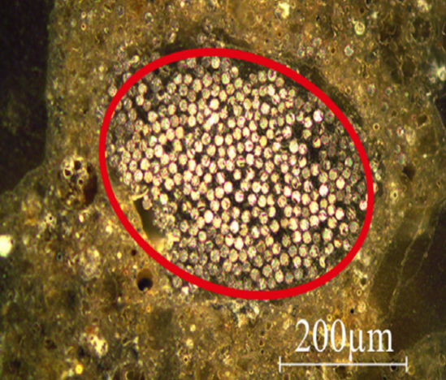
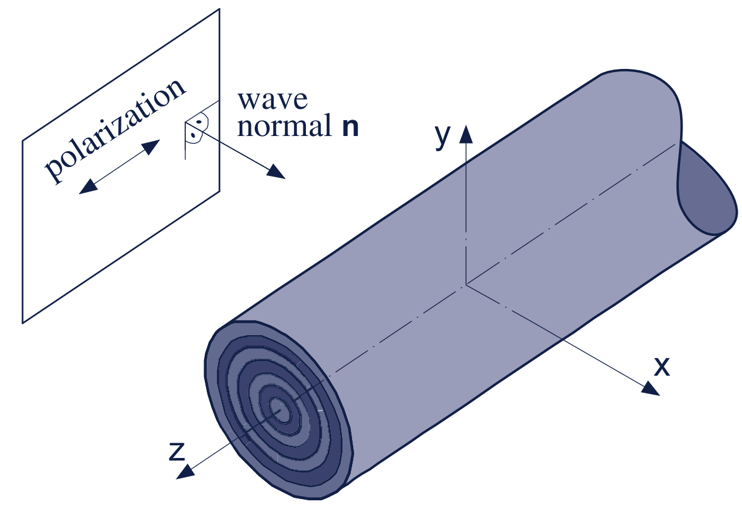
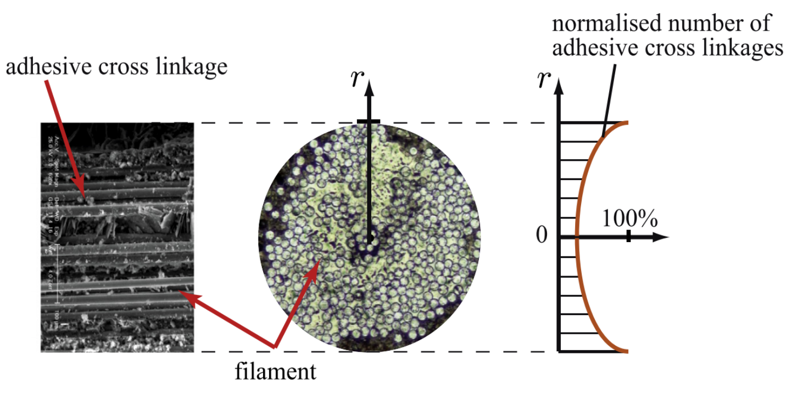
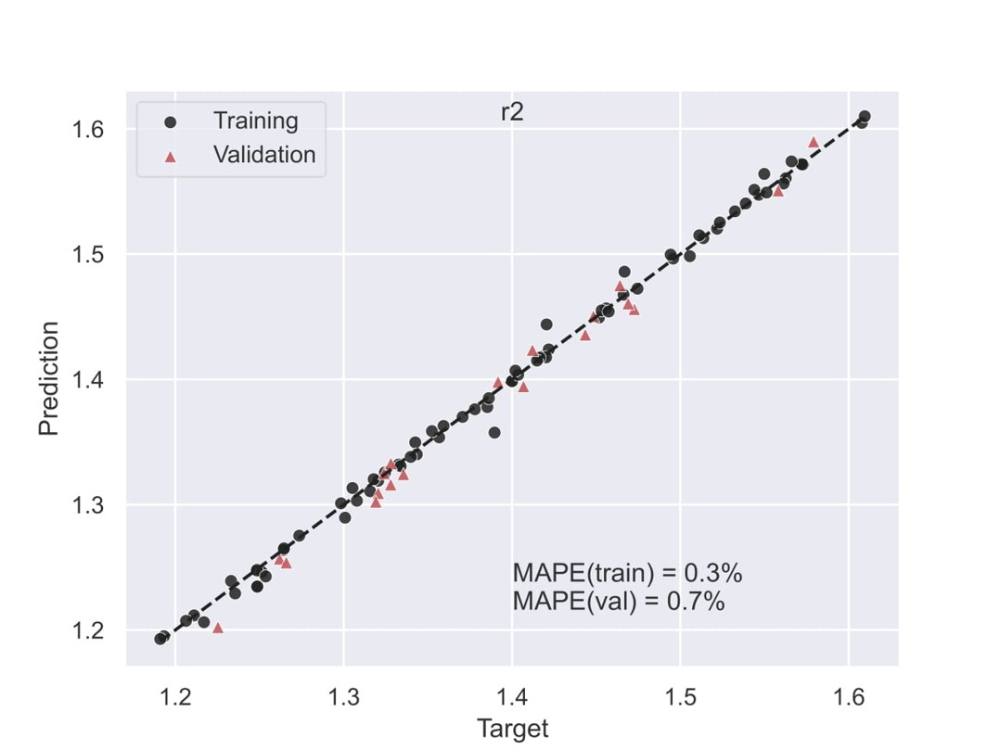
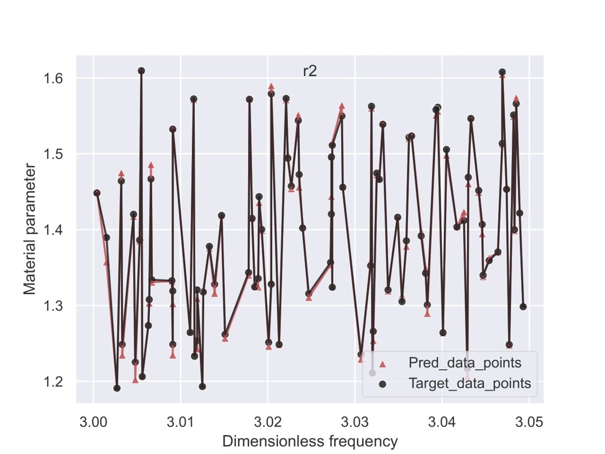

# Analysis of an autoencoder-based approach for determining the configuration of embedded obstacles

This repository contains the code, methods, and documentation for my Project Work during my Master’s in *Advanced Computational and Civil Engineering Structural Studies* at **TU Dresden**. The focus of the project is on developing a machine learning-based inverse modeling framework that can infer the internal microstructure of composite materials using ultrasonic amplitude response data.

---

## 📌 Overview

This project tackles the challenging **inverse problem** of estimating internal configuration parameters (geometry + material properties) of **fiber-reinforced cementitious composites** from the **amplitude spectra** of **ultrasonic wave scattering**. The solution involves combining a **2D analytical wave propagation model** with a **convolutional autoencoder-based neural network**.

---

## 🧪 Problem Background

Fiber-reinforced composites exhibit complex internal structures composed of:

- A **core fiber**
- One or more **interphase layers**
- A surrounding **matrix**

When subjected to ultrasonic waves, these internal heterogeneities scatter waves in distinctive ways. The way these waves scatter carries valuable information about the **geometry** and **material properties** of internal inclusions (e.g., fiber radii, stiffness, density).

However, traditional **analytical models** break down when complexity increases (e.g., multilayered or non-homogeneous structures). Hence, a **numerical metamodel** using deep learning was proposed to decode wave data back into internal structure.

---

## 🎯 Objective

To develop a deep learning framework (based on convolutional autoencoders) that can:

- Analyze **ultrasonic amplitude response fields**
- **Infer unknown internal configurations** (e.g., layer radii, elastic moduli, and densities)
- Act as a **numerical metamodel** to supplement or replace traditional analytical models

---

## 🧰 Methodology

### 1. Data Generation – Analytical Model

- A **2D mechanical wave scattering model** was used to simulate a cross-section of a fiber-reinforced composite.
- The composite includes:
  - A **core fiber**
  - One or more **interphase layers**
  - An outer **matrix**
- The model computes how ultrasonic waves scatter as they encounter these inclusions.
- A **large spatial grid** was defined in the simulation domain.
- **The refracted amplitude fields were normalized** before being used for model training.
  
  > 🔎 *This normalization ensures that variations due to absolute signal intensity (e.g., sensor sensitivity, source energy) don't bias the learning process.*

> 🧾 **Each simulation corresponds to one unique configuration of material and geometric properties.**

---

## 🗃️ Dataset Structure

### 🔷 Input Columns (Obstacle Configuration)

These are the geometric and material properties for each simulation:

- `r_fiber`: Radius of the fiber  
- `t_interphase`: Thickness of the interphase layer  
- `E_matrix`, `rho_matrix`: Young’s modulus and density of the matrix  
- `E_interphase`, `rho_interphase`: Modulus and density of the interphase  
- `E_fiber`, `rho_fiber`: Modulus and density of the fiber  

### 🔶 Output Columns (Amplitude Response Field)

- Each simulation outputs **100,000 amplitude values**, one for each **physical point** in the spatial domain (i.e., a 2D grid over the composite cross-section).
- These values form a **high-dimensional response field**—showing how waves scatter across space.

> ✅ **Each datapoint in the output vector represents the amplitude at one physical location in the model.**

---

## 🧠 Inverse Model

The inverse problem is to **predict input configuration parameters from the amplitude response field**.

### 🔄 Mapping

```text
Amplitude Response Field (100,000-dimensional vector) → [r_fiber, t_interphase, E_matrix, ..., rho_fiber]
```

This was solved using a **deep convolutional autoencoder** with a small dataset and several learning enhancements.

---

## 🏗️ Machine Learning Pipeline

### ✔️ Architecture

- Autoencoder structure with:
  - **Convolutional encoders** to compress the 100k-point wave field into latent features
  - **Fully connected decoder** to predict obstacle parameters from these features

### ✔️ Dataset Size

- **Total samples**: 94  
- Each sample has:
  - One set of 8 input parameters
  - One set of 100,000 amplitude values (output)

> ℹ️ The relatively small number of samples was balanced by high-resolution wave data and smart training strategies.

---

## 🧪 Advanced Training Strategies

### ✅ Patchwise Training

- Rather than using the entire amplitude field, training was done over **narrow "patches"**—small spatial regions within the 2D domain.
- This improved:
  - Local learning
  - Model generalization
  - Outlier robustness

### ✅ Similarity Filtering

- Inverse problems can be **ill-posed** if multiple configurations yield nearly identical wave responses.
- So, a **similarity analysis** was conducted:
  - Compared output vectors
  - Removed near-duplicates
- This ensured a **bijective mapping** between inputs and outputs.

### ✅ Normalization

- Inputs (e.g., radii in mm, densities in kg/m³) were normalized to prevent scale mismatch during training.
- This helped:
  - Gradient flow
  - Faster convergence
  - Better generalization

---

## 📈 Model Performance

### 🔹 Training vs. Validation Loss

- Training loss decreases smoothly  
- Validation loss plateaus → indicates some overfitting but still strong learning

### 🔹 Prediction Accuracy

r1: Radius of the fiber core (innermost circle)

r2: Radius of the interphase layer boundary, i.e., the outer boundary of the interphase

| Parameter | Training MAPE | Validation MAPE |
|-----------|----------------|------------------|
| r1        | ~0.3%          | ~0.7%            |
| r2        | ~0.5%          | ~2.3%            |

---

## 🖼️ Visual Explanation

Below are figures included in this repository to help visualize the model and results:

### 📌 3D & 2D View of Fiber Structure
- 3D rendering of cylindrical fiber within a matrix


- 2D cross-section shows concentric layers (core, interphase, matrix)


### 📌 Microstructure & Adhesive Profile
- SEM and micrograph images show real-world fiber cross-sections
- Plot shows radial adhesive cross-link density (supports modeling assumptions)


### 📌 Predicted vs Actual r2
- Scatter plot comparing predicted and actual values
- High overlap = strong predictive power


### 📌 Material Parameter vs Frequency Patch
- Stability of predictions across small frequency window (patch from 3.00 to 3.05)


> 📌 *Note*: Visualizations shown here focus on selected key parameters (e.g., r2).  
> ✨ Similar plots were created for other material and geometric parameters, all showing strong predictive performance. These have been omitted from the repository for brevity.

---

## 🔭 Future Work

- **Increase patch size**: Currently performance drops with broader spatial regions due to increased function complexity.  
- **Generate more samples**: Especially near zones of non-smooth response behavior.  
- **Explore advanced models**:  
  - Physics-informed neural networks (PINNs)  
  - Transformers for inverse modeling  
- **Multiscale modeling**: Incorporate 3D effects or layer-level behavior  

---

## 📚 Technologies Used

- Python (NumPy, SciPy)  
- TensorFlow / Keras (Convolutional Autoencoders)  
- Matplotlib / Seaborn (visualization)  
- Custom-built analytical model for wave propagation  

---

## 🙋‍♂️ Author

**Anvar Mohamed Aslam Sha**  
Project Work – TU Dresden  
Master’s in Advanced Computational and Civil Engineering Structural Studies  
Email: aslamshaw97@gmail.com  

---

## 📂 License

This project is academic in nature and is intended for educational and research purposes. Please credit the original author when using or referencing any part of this work.

---
